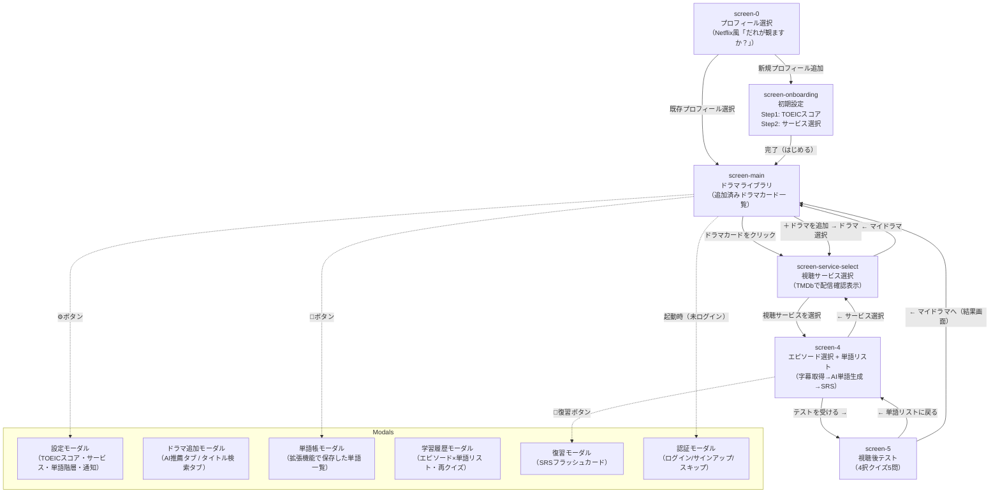

> ⚠️ **旧版アーカイブ（2026-07-02）**: これは旧バニラ版（js/app.js・cine-learn.vercel.app）時代の文書です。
> 現行の公開ターゲットは `next-app/`（cinelearn-next.vercel.app）。現行構成は git 履歴と `docs/` の各設計書を参照。

# CineLearn 技術仕様書

最終更新: 2026-06-06

---

## 1. プロジェクト概要

### アプリ名・概要

**CineLearn**（シネラーン）は「ドラマで英語を学ぶ」Progressive Web App (PWA) + Chrome拡張機能のセットです。  
ユーザーが視聴するドラマ・エピソードの実際の英語字幕（OpenSubtitles）を取得し、Claude AI で学習者のTOEICレベルに合った単語リストを自動生成します。SRS（間隔反復）フラッシュカードで単語を定着させ、4択クイズで理解度を確認する一気通貫の学習フローを提供します。

### URL

- **本番**: https://cine-learn.vercel.app
- **デプロイ先**: Vercel（Vercel Functions + Cron）

### 技術スタック

| レイヤー | 技術 |
|---|---|
| フロントエンド | Vanilla HTML/CSS/JS（フレームワークなし）、PWA (Service Worker) |
| バックエンド API | Vercel Functions（Node.js ESM） |
| AI | Claude Haiku 4.5（anthropic API） |
| 字幕取得 | OpenSubtitles API v1 |
| 映像メタデータ | TMDB (The Movie Database) API |
| クラウドDB / 認証 | Supabase（PostgreSQL + Auth + REST API） |
| プッシュ通知 | Web Push API + Vercel Cron |
| Chrome拡張 | Manifest V3（content_scripts + service_worker） |

### ファイル構成

```
cinelearn/
├── index.html              # メインアプリ（SPA）
├── landing.html            # ランディングページ
├── site.webmanifest        # PWA マニフェスト
├── sw.js                   # Service Worker（キャッシュ・Push受信）
├── manifest.json           # Chrome拡張マニフェスト（Manifest V3）
├── vercel.json             # Vercel設定（ヘッダー・Cron）
├── supabase_schema.sql     # Supabaseテーブル定義
├── package.json
│
├── css/
│   └── style.css           # メインスタイルシート
│
├── js/
│   ├── app.js              # アプリケーション本体（3543行）
│   ├── supabase.js         # Supabase認証・同期レイヤー
│   ├── wordlist.js         # 除外語リスト（getExcludeSet）
│   └── sw-register.js      # Service Worker 登録
│
├── api/                    # Vercel Functions
│   ├── claude.js           # POST /api/claude（Anthropic APIプロキシ）
│   ├── subtitles.js        # POST /api/subtitles（OpenSubtitles プロキシ）
│   ├── tmdb.js             # POST /api/tmdb（TMDB APIプロキシ）
│   ├── push-subscribe.js   # POST /api/push-subscribe（購読情報保存）
│   └── push-notify.js      # GET /api/push-notify（Cronプッシュ送信）
│
├── extension/
│   ├── content.js          # Netflix/YouTube字幕単語保存
│   ├── content.css         # 字幕オーバーレイスタイル
│   ├── background.js       # Service Worker（単語→Supabase同期）
│   └── bridge.js           # chrome.storage→localStorage ブリッジ
│
└── icons/                  # PWAアイコン
```

---

## 2. データ構造（State）

`js/app.js` 内のグローバル変数一覧。

| 変数名 | 型 | 初期値 | 用途 |
|---|---|---|---|
| `selectedServices` | `string[]` | `[]` | 設定済みの動画サービス名リスト |
| `selectedGenres` | `string[]` | `['Crime Thriller']` | ドラマ推薦時のジャンル選択 |
| `selectedDrama` | `object\|null` | `null` | 現在選択中のドラマオブジェクト（title, platform, genre, englishTitle, tmdbId, posterPath等） |
| `myDramas` | `object[]` | `[]` | ライブラリに追加済みのドラマ一覧 |
| `selectedSeason` | `number` | `1` | 選択中シーズン番号 |
| `selectedEpisode` | `number` | `1` | 選択中エピソード番号 |
| `quizData` | `object[]` | `[]` | 現在のクイズ問題配列（question/answer/choices/explanation） |
| `currentQ` | `number` | `0` | クイズの現在問題インデックス |
| `score` | `number` | `0` | クイズ正解数 |
| `answered` | `boolean` | `false` | 現在問題への回答済みフラグ |
| `userLevel` | `string` | `'B1'` | 学習者の英語レベル（A2/B1/B2/C1） |
| `toeicScore` | `number` | `0` | 現在のTOEICスコア |
| `targetToeicScore` | `number` | `0` | 目標TOEICスコア（未入力時は0） |
| `targetLevel` | `string` | `'B1'` | 目標レベル（TOEICスコアから自動算出） |
| `vocabCount` | `number` | `30` | 単語生成数（目標スコアから自動決定：20/30/40/50） |
| `vocabWords` | `object[]` | `[]` | 現在エピソードの単語リスト（word/pos/definition/example/tier等） |
| `dramaSeasonInfo` | `object[]` | `[]` | TMDbから取得したシーズン情報（{season, episodes}の配列） |
| `selectedViewingService` | `string\|null` | `null` | 今回の視聴サービス名 |
| `testTiers` | `string[]` | `['core', 'advanced']` | テストに含める単語階層 |
| `currentHistoryId` | `string\|null` | `null` | 現在操作中の履歴エントリID |
| `currentProfileId` | `string\|null` | `null` | 選択中プロフィールのID |
| `obSelectedServices` | `string[]` | `[]` | オンボーディング中に選択したサービス（一時変数） |
| `cachedSubtitleText` | `string` | `''` | パース済みの字幕テキスト（SRT→セリフのみ） |
| `cachedSubtitleSource` | `string` | `''` | 字幕ソース説明文 |
| `cachedRawSrt` | `string` | `''` | 生SRTテキスト（タイムスタンプ検索用） |
| `reviewQueue` | `object[]` | `[]` | 復習フラッシュカードのキュー |
| `reviewQIdx` | `number` | `0` | 復習キュー内の現在インデックス |
| `reviewRatings` | `object` | `{}` | 単語→quality(0/3/5)のマップ（セッション内） |
| `currentSessionNum` | `number` | `0` | 今日の復習回数 |
| `vocabClickListener` | `function\|null` | `null` | vocabSection のイベントリスナー参照（付け替え管理用） |
| `currentVocabLabel` | `string` | `''` | renderVocabに渡したsourceLabel（再描画時に使用） |
| `currentVocabWords` | `object[]` | `[]` | renderVocabで表示中の単語リスト（復習開始・再描画に使用） |
| `_fillJaRunning` | `boolean` | `false` | 例文日本語翻訳の二重実行防止フラグ |
| `_extPollTimer` | `number\|null` | `null` | screen-4ポーリングタイマーID |
| `_extPollSnapshot` | `string` | `''` | ポーリング比較用スナップショット |
| `_lastPullAt` | `number` | `0` | 最後のpullFromCloud実行時刻（ms） |
| `API_BASE` | `string` (const) | `''` または `'https://cine-learn.vercel.app'` | API呼び出しのベースURL（拡張機能内では絶対URLを使用） |
| `IRREGULAR_VERBS` | `object` (const) | 不規則動詞テーブル | 活用形バリアント生成用（原形→活用形配列） |
| `IRREGULAR_REVERSE` | `object` (const) | 逆引きマップ | 活用形→原形の逆引き |
| `AVATAR_COLORS` | `string[]` (const) | 8色 | プロフィールアバター色 |
| `VAPID_PUBLIC_KEY` | `string` (const) | BDvz...Aslk | Web Push VAPID公開鍵 |

---

## 3. localStorageキー一覧

| キー名 | 内容 | 形式 |
|---|---|---|
| `cl_profiles` | プロフィール配列（id, name, color, settings） | JSON配列 |
| `cl_history` | 学習履歴配列（上限50件） | JSON配列 |
| `cl_srs` | SRSデータ（単語→{interval, repetitions, easeFactor, dueDate, lastReview, skipped, reviewCount}） | JSONオブジェクト |
| `cl_my_words` | 拡張機能で保存した単語リスト（全プロフィール共通・Supabaseから同期） | JSON配列 |
| `cl_my_words_{profileId}` | プロフィール別の単語リスト（例: `cl_my_words_p_1234567890`） | JSON配列 |
| `cl_deleted_words` | 全プロフィール共通の削除済み単語リスト | JSON配列 |
| `cl_deleted_words_{profileId}` | プロフィール別の削除済み単語リスト | JSON配列 |
| `cl_review_log` | 復習セッション記録（{date, historyId, sessionNum, easy, hard, fail, total}） | JSON配列 |
| `cl_sb_session` | Supabaseセッション情報（access_token, refresh_token, user, expires_at） | JSONオブジェクト |
| `cl_sub_{title}_s{N}e{N}` | パース済み字幕テキストキャッシュ（例: `cl_sub_suits_s1e1`） | string |
| `cl_sub_raw_{title}_s{N}e{N}` | 生SRTキャッシュ（タイムスタンプ検索用、例: `cl_sub_raw_suits_s1e1`） | string |

---

## 4. Supabaseテーブル構成

Supabase URL: `https://mndyexwdevkpdssglwpl.supabase.co`

### profiles テーブル

ユーザーのプロフィール情報を保存する。Netflix風の「誰が観ますか？」画面に対応。

| カラム | 型 | 説明 |
|---|---|---|
| `id` | TEXT (PK) | プロフィールID（例: `p_1234567890`） |
| `user_id` | UUID (FK) | auth.users への参照 |
| `name` | TEXT | プロフィール名 |
| `color` | TEXT | アバター背景色（hex） |
| `settings` | JSONB | 全設定（toeicScore, selectedServices, selectedDrama, vocabWords等を格納） |
| `updated_at` | TIMESTAMPTZ | 最終更新日時 |

**RLS**: `auth.uid() = user_id`（自分のデータのみ全操作可）

### history テーブル

エピソードごとの学習履歴。単語リストとクイズデータも格納。

| カラム | 型 | 説明 |
|---|---|---|
| `id` | TEXT (PK) | 履歴ID（`Date.now().toString()`） |
| `user_id` | UUID (FK) | auth.users への参照 |
| `drama` | JSONB | ドラマ情報（title, genre, platform） |
| `season` | INTEGER | シーズン番号 |
| `episode` | INTEGER | エピソード番号 |
| `level` | TEXT | 学習時のユーザーレベル（A2/B1/B2/C1） |
| `target_level` | TEXT | 目標レベル |
| `words` | JSONB | 単語リスト配列（word/pos/definition/example/example_ja/tier/source） |
| `quiz` | JSONB | クイズ問題配列（question/answer/choices/explanation） |
| `quiz_score` | INTEGER | クイズスコア（%） |
| `quiz_date` | TEXT | クイズ実施日（`toLocaleDateString('ja-JP')`） |
| `date` | TEXT | 学習日 |
| `updated_at` | TIMESTAMPTZ | 最終更新日時 |

**RLS**: `auth.uid() = user_id`

### srs_data テーブル

SM-2アルゴリズムのデータを単語単位で保存。

| カラム | 型 | 説明 |
|---|---|---|
| `user_id` | UUID (PK+FK) | auth.users への参照 |
| `word` | TEXT (PK) | 英単語（小文字） |
| `interval` | INTEGER | 次回復習までの日数 |
| `repetitions` | INTEGER | 連続正解回数 |
| `ease_factor` | DECIMAL(4,2) | 定着度係数（1.3〜） |
| `due_date` | TEXT | 次回復習予定日（YYYY-MM-DD） |
| `last_review` | TEXT | 最終復習日（YYYY-MM-DD） |
| `skipped` | BOOLEAN | スキップ中フラグ |
| `updated_at` | TIMESTAMPTZ | 最終更新日時 |

**RLS**: `auth.uid() = user_id`

### my_words テーブル

拡張機能（Netflix/YouTube字幕）でクリック保存した単語。

| カラム | 型 | 説明 |
|---|---|---|
| `user_id` | UUID (PK+FK) | auth.users への参照 |
| `word` | TEXT (PK) | 英単語 |
| `sentence` | TEXT | 字幕上のコンテキスト文 |
| `phonetic` | TEXT | 発音記号 |
| `pos` | TEXT | 品詞 |
| `definition` | TEXT | 意味（英語またはAI翻訳後の日本語） |
| `saved_at` | TEXT | 保存日時文字列 |
| `source` | TEXT | 保存元（'Netflix', 'YouTube'等） |
| `drama_title` | TEXT | 保存時のドラマタイトル |
| `season` | INTEGER | シーズン番号（不明な場合はNULL） |
| `episode` | INTEGER | エピソード番号（不明な場合はNULL） |
| `created_at` | TIMESTAMPTZ | 作成日時 |

**RLS**: `auth.uid() = user_id`  
**同期戦略**: 全削除→再挿入（削除した単語がクラウドに残らないことを保証）

### push_subscriptions テーブル

Web Push通知の購読情報。サービスロールキーのみアクセス可。

| カラム | 型 | 説明 |
|---|---|---|
| `user_id` | UUID (PK+FK) | auth.users への参照 |
| `endpoint` | TEXT (PK) | Push Endpointの URL |
| `p256dh` | TEXT | ECDH 公開鍵 |
| `auth` | TEXT | 認証シークレット |
| `updated_at` | TIMESTAMPTZ | 最終更新日時 |

**RLS**: `FOR ALL USING (false)` ＝ RLSをすべて拒否し、サービスロールキーのみで操作

---

## 5. 関数一覧

### js/app.js の関数

| 関数名 | 引数 | 戻り値 | 用途 | 行番号（概算） |
|---|---|---|---|---|
| `loadSrs()` | なし | `object` | cl_srs をlocalStorageから読み込む | 33 |
| `saveSrs(d)` | `d: object` | void | cl_srs に保存＋クラウド同期 | 34 |
| `todayStr()` | なし | `string` | 今日の日付（YYYY-MM-DD） | 38 |
| `isMastered(e)` | `e: object` | `boolean` | 習得済み判定（repetitions≥3 && interval≥21 && easeFactor≥2.0） | 40 |
| `isDue(e)` | `e: object` | `boolean` | 今日復習対象か判定 | 41 |
| `getWordStatus(word)` | `word: string` | `'new'\|'skipped'\|'mastered'\|'due'\|'reviewed_today'\|'scheduled'` | 単語のSRS状態を返す | 43 |
| `nextReviewLabel(word)` | `word: string` | `string\|null` | 次回復習日の表示文字列（「明日」「3日後」「6/15」等） | 54 |
| `skipWord(word)` | `word: string` | void | 単語をスキップ状態にする | 67 |
| `unskipWord(word)` | `word: string` | void | スキップ解除 | 72 |
| `reviewWord(word, quality)` | `word: string, quality: 0\|3\|5` | void | SM-2アルゴリズムでSRSデータを更新 | 78 |
| `episodeStats(words)` | `words: object[]` | `{total, mastered, due, skipped, reviewedToday}` | エピソード単語のSRS統計を集計 | 100 |
| `buildProgressHTML(words)` | `words: object[]` | `string` | 進捗バーのHTML文字列を生成 | 114 |
| `loadProfiles()` | なし | `object[]` | cl_profiles を読み込む | 151 |
| `saveProfiles(profiles)` | `profiles: object[]` | void | cl_profiles に保存＋クラウド同期 | 155 |
| `saveSettings()` | なし | void | 現在の状態変数を現在プロフィールのsettingsに書き込む | 161 |
| `applyProfileSettings(s)` | `s: object` | `Promise<void>` | プロフィールのsettingsを状態変数とUIに適用する | 176 |
| `selectProfile(id)` | `id: string` | void | プロフィールを選択してアプリを初期化 | 239 |
| `renderProfileScreen()` | なし | void | プロフィール選択画面（screen-0）を描画 | 277 |
| `startOnboarding()` | なし | void | 新規プロフィール作成時のオンボーディングフロー開始 | 338 |
| `showObStep2()` | なし | void | オンボーディング step1→step2 | 408 |
| `finishOnboarding()` | なし | void | オンボーディング完了・設定保存・ドラマ追加画面へ | 416 |
| `getToeicLevel(score)` | `score: number` | `'A2'\|'B1'\|'B2'\|'C1'` | TOEICスコアからCEFRレベルを判定 | 455 |
| `getVocabCount(score)` | `score: number` | `number` | 目標TOEICスコアから単語生成数を決定（20/30/40/50） | 463 |
| `onToeicInput()` | なし | void | TOEICスコア入力イベント処理 | 472 |
| `setToeic(score)` | `score: number` | void | TOEICスコアを直接セット | 487 |
| `showLevelResult(level)` | `level: string` | void | レベル判定結果をUIに表示 | 496 |
| `onTargetInput()` | なし | void | 目標TOEICスコア入力イベント処理 | 516 |
| `showStatus(id, msg, type)` | `id: string, msg: string, type: string` | void | ステータスメッセージを一時表示 | 542 |
| `startApp()` | なし | void | アプリ開始（goToStep(1)） | 550 |
| `goToStep(step)` | `step: number\|string` | void | 画面遷移（'main', 'onboarding', 0〜5） | 555 |
| `platformColor(platform)` | `platform: string` | `string` | サービス名→背景色 | 569 |
| `renderDramaLibrary()` | なし | void | ドラマライブラリ（screen-main）を描画 | 579 |
| `fetchMissingPosters(entries)` | `entries: object[]` | `Promise<void>` | posterPath未設定ドラマのポスター画像をバックグラウンドで取得 | 628 |
| `buildLibraryCard({drama, episodes, bestScore, lastDate})` | object | `HTMLElement` | ライブラリカードのDOM要素を生成 | 663 |
| `deleteDramaFromLibrary(title)` | `title: string` | void | ドラマをライブラリと履歴から削除 | 705 |
| `loadDramaFromLibrary(drama)` | `drama: object` | `Promise<void>` | ドラマカードクリック→サービス選択画面へ | 731 |
| `openSettings()` | なし | void | 設定モーダルを開く | 943 |
| `closeSettings()` | なし | void | 設定モーダルを閉じる | 950 |
| `saveSettingsFromModal()` | なし | void | 設定モーダルの「保存して始める」処理 | 954 |
| `openAddDrama()` | なし | void | ドラマ追加モーダルを開く | 969 |
| `closeAddDrama()` | なし | void | ドラマ追加モーダルを閉じる | 972 |
| `switchAddDramaTab(tab)` | `tab: string` | void | ドラマ追加モーダルのタブ切替 | 980 |
| `manualSearchDrama()` | なし | `Promise<void>` | タイトル検索（Claude APIで情報取得） | 988 |
| `toggleService(card)` | `card: HTMLElement` | void | サービスカードの選択トグル | 1010 |
| `fetchSeasonInfoFromTMDb(title)` | `title: string` | `Promise<object\|null>` | TMDb APIでシーズン・エピソード情報取得 | 1031 |
| `callClaude(prompt, maxTokens, onRetry)` | `prompt: string, maxTokens?: number, onRetry?: function` | `Promise<string>` | Claude APIを呼び出す（過負荷時は最大3回リトライ） | 1066 |
| `searchSubtitles(title, season, episode)` | `title: string, season: number, episode: number` | `Promise<object[]>` | OpenSubtitles APIで字幕検索 | 1090 |
| `downloadSubtitle(fileId)` | `fileId: string` | `Promise<string>` | 字幕ファイルをダウンロード（SRTテキスト） | 1102 |
| `parseSrt(srtText)` | `srtText: string` | `string` | SRTからセリフのみ抽出してスペース区切り文字列に変換 | 1113 |
| `getWordVariants(word)` | `word: string` | `Set<string>` | 活用形・語幹バリアントのセット生成（不規則動詞・ing/ed/s展開） | 1192 |
| `findWordTimestampInSrt(srtText, word)` | `srtText: string, word: string` | `string\|null` | SRTから単語（またはフレーズ）が最初に登場するタイムスタンプを返す | 1270 |
| `findWordTimestamp(word)` | `word: string` | `string\|null` | キャッシュ済みSRT全体から単語のタイムスタンプを検索 | 1321 |
| `buildSeasonEpisodeSelectors(seasons)` | `seasons: object[]` | void | シーズン・エピソードのselectを動的構築 | 1340 |
| `updateEpisodeSelector(episodeCount)` | `episodeCount: number` | void | エピソード選択肢を更新 | 1353 |
| `onEpisodeChange()` | なし | `Promise<void>` | エピソードselect変更ハンドラ | 1363 |
| `triggerEpisodeLoad()` | なし | `Promise<void>` | エピソード読み込みをトリガー（保存済み単語確認→字幕ロード） | 1368 |
| `subtitleCacheKey(title, season, episode)` | `title: string, season: number, episode: number` | `string` | パース済み字幕のlocalStorageキー生成 | 1401 |
| `subtitleRawCacheKey(title, season, episode)` | `title: string, season: number, episode: number` | `string` | 生SRTのlocalStorageキー生成 | 1405 |
| `getMyWordsForEpisode(dramaTitle, season, episode)` | `dramaTitle: string, season: number, episode: number` | `Promise<object[]>` | 拡張機能単語から現エピソードのものを抽出 | 1412 |
| `resolveUnassignedWords()` | なし | `Promise<void>` | 未割当単語（season==null）のエピソードを字幕キャッシュから自動解決 | 1441 |
| `buildExtWordHTML(w)` | `w: object` | `string` | 拡張機能単語カードのHTML生成 | 1500 |
| `translateExtWordDefinitions(extWords)` | `extWords: object[]` | `Promise<void>` | 英語定義を日本語に一括翻訳してlocalStorageに保存 | 1554 |
| `renderExtWordsSection(existingWords)` | `existingWords?: object[]` | `Promise<void>` | 拡張機能単語セクションをvocabSectionに追加・再描画 | 1600 |
| `checkAndShowSavedVocab()` | なし | `Promise<boolean>` | 保存済み単語の有無を確認して表示（あればtrue） | 1678 |
| `preloadSubtitle()` | なし | `Promise<void>` | OpenSubtitlesから字幕を取得・スコアリング・キャッシュ | 1720 |
| `preloadSubtitleSilent(cacheKey)` | `cacheKey: string` | `Promise<void>` | UIを変えずに字幕をサイレントキャッシュ | 1803 |
| `generateVocabFromEpisode()` | なし | `Promise<void>` | Claude APIで字幕テキストから単語リストを生成 | 1823 |
| `renderVocab(words, sourceLabel, skipHistory)` | `words: object[], sourceLabel?: string, skipHistory?: boolean` | `Promise<void>` | 単語リストをscreen-4に描画（SRSバッジ・タイムスタンプ付き） | 2027 |
| `fillMissingExampleJa(words, sourceLabel)` | `words: object[], sourceLabel: string` | `Promise<void>` | example_jaが未翻訳の単語をAIでバックグラウンド翻訳 | 2193 |
| `fetchRawSrtIfMissing(words, sourceLabel)` | `words: object[], sourceLabel: string` | `Promise<void>` | 生SRTが未キャッシュの場合にバックグラウンドで取得 | 2237 |
| `startReview(words)` | `words: object[]` | void | 復習フラッシュカードセッション開始 | 2294 |
| `renderReviewCard()` | なし | void | 復習カードまたは完了画面を描画 | 2306 |
| `loadReviewLog()` | なし | `object[]` | cl_review_log を読み込む | 2270 |
| `saveReviewLog(log)` | `log: object[]` | void | cl_review_log に保存 | 2273 |
| `todaySessionCount(historyId)` | `historyId: string` | `number` | 今日の復習セッション回数を返す | 2275 |
| `recordReviewSession(historyId, easy, hard, fail)` | numbers | `number` | 復習セッションを記録して通し番号を返す | 2280 |
| `getTodaySessions(historyId)` | `historyId: string` | `object[]` | 今日の復習セッション一覧を返す | 2289 |
| `getRecommendations()` | なし | `Promise<void>` | Claude APIでドラマ推薦を取得 | 2435 |
| `renderDramas(dramas, containerId)` | `dramas: object[], containerId?: string` | void | ドラマカードリストを描画 | 2486 |
| `selectDrama(drama, card)` | `drama: object, card: HTMLElement` | void | ドラマを選択して学習フローへ | 2511 |
| `selectViewingService(service, drama)` | `service: string, drama: object` | `Promise<void>` | 視聴サービス選択後にscreen-4へ遷移・シーズン情報取得 | 2523 |
| `generateQuiz(drama, words)` | `drama: object, words: object[]` | `Promise<void>` | Claude APIで5問4択クイズを生成（バックグラウンド） | 2591 |
| `goToQuiz()` | なし | void | テスト画面（screen-5）へ遷移 | 2629 |
| `renderQuiz()` | なし | void | クイズ問題を描画 | 2653 |
| `answer(btn, selected, correct, explanation)` | HTMLElement, strings | void | クイズ回答処理 | 2690 |
| `nextQuestion()` | なし | void | 次の問題へ | 2711 |
| `renderScore()` | なし | void | クイズ結果画面を描画・履歴スコア保存 | 2717 |
| `onSeasonChange()` | なし | `Promise<void>` | シーズンselect変更ハンドラ | 2747 |
| `loadHistory()` | なし | `object[]` | cl_history を読み込む | 2763 |
| `saveToHistory()` | なし | void | 単語生成後に履歴を保存（同エピソードは上書き） | 2772 |
| `updateHistoryWords(id, words)` | `id: string, words: object[]` | void | 履歴の単語リストを更新 | 2823 |
| `updateHistoryQuizData(id, quiz)` | `id: string, quiz: object[]` | void | 履歴のクイズデータを更新 | 2834 |
| `updateHistoryScore(id, pct)` | `id: string, pct: number` | void | 履歴のクイズスコアを更新 | 2846 |
| `updateHistoryBadge()` | なし | void | ヘッダーの履歴件数バッジを更新 | 2859 |
| `openHistory()` | なし | void | 学習履歴モーダルを開く | 2868 |
| `closeHistory()` | なし | void | 学習履歴モーダルを閉じる | 2874 |
| `renderHistoryList()` | なし | void | 履歴一覧をモーダルに描画 | 2887 |
| `showHistoryVocab(id)` | `id: string` | void | 履歴から単語リストをモーダルに表示 | 2955 |
| `retakeHistoryQuiz(id)` | `id: string` | void | 履歴のクイズを再受験 | 2992 |
| `deleteHistoryItem(id)` | `id: string` | void | 履歴エントリを1件削除 | 3010 |
| `myWordsKey()` | なし | `string` | 現在プロフィールの単語リストキーを返す | 3081 |
| `deletedWordsKey()` | なし | `string` | 現在プロフィールの削除済み単語リストキーを返す | 3086 |
| `getDeletedWords()` | なし | `string[]` | 削除済み単語リストを取得 | 3089 |
| `addToDeletedWords(wordTexts)` | `wordTexts: string\|string[]` | void | 削除済みリストに追加 | 3093 |
| `getActiveWords()` | なし | `Promise<object[]>` | 削除済みを除いた有効な単語リストを返す | 3099 |
| `openWordbook()` | なし | `Promise<void>` | 単語帳モーダルを開く | 3125 |
| `closeWordbook()` | なし | void | 単語帳モーダルを閉じる | 3131 |
| `renderWordbook()` | なし | `Promise<void>` | 単語帳の内容を描画 | 3141 |
| `deleteMyWord(wordText)` | `wordText: string` | `Promise<void>` | 単語を1件削除 | 3201 |
| `clearAllWords()` | なし | `Promise<void>` | 単語をすべて削除 | 3210 |
| `updateWordbookBadge()` | なし | `Promise<void>` | ヘッダーの単語件数バッジを更新 | 3220 |
| `onMyWordsChanged()` | なし | void | 単語リスト変更時の再描画ハンドラ | 3230 |
| `initEventListeners()` | なし | void | 全ボタンのイベントリスナーを登録 | 3266 |
| `initPushNotify()` | なし | `Promise<void>` | Web Push通知の設定ボタン初期化 | 3392 |
| `startExtPoll()` | なし | void | screen-4表示中の単語ポーリング開始（5秒間隔） | 3516 |
| `stopExtPoll()` | なし | void | ポーリング停止 | 3539 |

### js/supabase.js の関数

| 関数名 | 引数 | 戻り値 | 用途 | 行番号 |
|---|---|---|---|---|
| `sbEnabled()` | なし | `boolean` | Supabase設定済みか確認 | 21 |
| `getSession()` | なし | `object\|null` | cl_sb_session を読み込む | 24 |
| `setSession(d)` | `d: object` | void | セッションをlocalStorage+chrome.storageに保存 | 25 |
| `clearSession()` | なし | void | セッション削除 | 31 |
| `getCurrentUser()` | なし | `object\|null` | セッションからユーザー情報を返す | 37 |
| `isLoggedIn()` | なし | `boolean` | ログイン中かつトークン有効期限チェック | 38 |
| `sbHeaders(extra)` | `extra?: object` | `object` | Supabase APIリクエストヘッダーを生成 | 46 |
| `sbFetch(path, opts)` | `path: string, opts?: object` | `Promise<object\|null>` | Supabase REST APIを呼び出す共通ラッパー | 53 |
| `supaSignUp(email, password)` | strings | `Promise<object>` | メールアドレスでサインアップ | 63 |
| `supaSignIn(email, password)` | strings | `Promise<object>` | メールアドレスでサインイン | 71 |
| `supaSignOut()` | なし | `Promise<void>` | サインアウト・セッション削除 | 79 |
| `supaRefreshSession()` | なし | `Promise<void>` | リフレッシュトークンでセッション更新 | 84 |
| `cloudSync.profiles(profiles)` | `profiles: object[]` | `Promise<void>` | プロフィールをSupabaseに一括upsert | 96 |
| `cloudSync.history(history)` | `history: object[]` | `Promise<void>` | 学習履歴をSupabaseに一括upsert | 109 |
| `cloudSync.srs(srsData)` | `srsData: object` | `Promise<void>` | SRSデータをSupabaseに一括upsert | 126 |
| `cloudSync.deleteWord(wordText)` | `wordText: string` | `Promise<void>` | my_wordsから1件削除 | 145 |
| `cloudSync.clearWords()` | なし | `Promise<void>` | my_wordsを全件削除 | 155 |
| `cloudSync.myWords(words)` | `words: object[]` | `Promise<void>` | my_wordsを全削除→再挿入（置き換え戦略） | 161 |
| `pullFromCloud()` | なし | `Promise<void>` | Supabaseから全データを引き下ろしてlocalStorageを更新 | 182 |
| `pushLocalToCloud()` | なし | `Promise<void>` | 初回ログイン時にローカルデータをSupabaseにアップロード | 264 |
| `showAuthModal()` | なし | void | 認証モーダルを表示 | 281 |
| `hideAuthModal()` | なし | void | 認証モーダルを非表示 | 285 |
| `initAuthModal()` | なし | void | 認証モーダルのUIとイベントリスナーを初期化 | 291 |
| `initSupabase()` | なし | `Promise<void>` | Supabase初期化エントリーポイント | 377 |

---

## 6. API一覧

すべてのエンドポイントは Vercel Functions（Node.js ESM）として `/api/` ディレクトリに配置。環境変数はVercelのダッシュボードで設定。

| エンドポイント | メソッド | 用途 | 認証 | 必須環境変数 |
|---|---|---|---|---|
| `POST /api/claude` | POST | Anthropic APIプロキシ。`{prompt, maxTokens}`を受け取りClaudeの応答テキストを返す | なし（サーバー側APIキー） | `ANTHROPIC_API_KEY` |
| `POST /api/subtitles` | POST | OpenSubtitles APIプロキシ。`action: 'search'`で字幕検索、`action: 'download'`でSRTダウンロード | なし | `OPENSUBTITLES_API_KEY` |
| `POST /api/tmdb` | POST | TMDB APIプロキシ。`action: 'search'`でドラマ検索、`action: 'seasons'`でシーズン情報、`action: 'watch_providers'`で視聴可能サービス | なし | `TMDB_API_KEY` |
| `POST /api/push-subscribe` | POST | Web Push購読情報（endpoint/p256dh/auth）をSupabaseに保存。`{subscription, user_id}`を受け取る | なし（サーバー側サービスキー） | `SUPABASE_URL`, `SUPABASE_SERVICE_KEY` |
| `GET /api/push-notify?type=morning` | GET | Vercel Cron（JST 7時 = UTC 22時）。復習日のユーザーに「今日N単語の復習があります」をプッシュ送信 | `CRON_SECRET`ヘッダー | `SUPABASE_URL`, `SUPABASE_SERVICE_KEY`, `VAPID_PUBLIC_KEY`, `VAPID_PRIVATE_KEY` |
| `GET /api/push-notify?type=evening` | GET | Vercel Cron（JST 21時 = UTC 12時）。全購読者に「次のエピソードを見る前に復習しませんか？」をプッシュ送信 | `CRON_SECRET`ヘッダー | 同上 |

**Vercel Cronスケジュール（vercel.json）:**
```json
{ "path": "/api/push-notify?type=morning", "schedule": "0 22 * * *" },
{ "path": "/api/push-notify?type=evening", "schedule": "0 12 * * *" }
```

---

## 7. 画面遷移図



---

## 8. SRSアルゴリズム

### 実装箇所

`js/app.js` 33〜112行目

### SM-2 アルゴリズム実装

```javascript
// quality: 0=知らなかった, 3=うろ覚え, 5=知ってた
function reviewWord(word, quality) {
  const all = loadSrs(), k = word.toLowerCase();
  let e = all[k] || { interval: 1, repetitions: 0, easeFactor: 2.5, skipped: false };

  if (quality < 3) {
    // 失敗: リセット
    e.repetitions = 0;
    e.interval    = 1;
  } else {
    // 成功: intervalを更新
    if      (e.repetitions === 0) e.interval = 1;
    else if (e.repetitions === 1) e.interval = 6;
    else                          e.interval = Math.round(e.interval * e.easeFactor);

    // easeFactor更新（SM-2の公式）
    e.easeFactor = Math.max(1.3, e.easeFactor + 0.1 - (5 - quality) * (0.08 + (5 - quality) * 0.02));
    e.repetitions++;
  }
  // 次回復習日を計算
  const d = new Date(); d.setDate(d.getDate() + e.interval);
  e.dueDate     = d.toISOString().slice(0, 10);
  e.lastReview  = todayStr();
  e.lastQuality = quality;
  e.reviewCount = (e.reviewCount || 0) + 1;
  all[k] = e;
  saveSrs(all);
}
```

### パラメータ

| パラメータ | 初期値 | 説明 |
|---|---|---|
| `interval` | 1 | 次回復習日までの日数 |
| `repetitions` | 0 | 連続成功回数 |
| `easeFactor` | 2.5 | 定着度係数（下限1.3） |

### interval の変化規則

| 状態 | interval |
|---|---|
| 失敗（quality < 3）またはrepetitions=0 | 1日 |
| repetitions = 1 | 6日 |
| repetitions ≥ 2 | `round(interval × easeFactor)` |

### 習得条件（isMastered）

```
repetitions >= 3 AND interval >= 21 AND easeFactor >= 2.0 AND skipped == false
```

すべてを満たした単語は「⭐ 習得済み」となり、復習対象から外れる。

### 復習対象判定（isDue）

```
!mastered AND !skipped AND (dueDate が未設定 OR dueDate <= today)
```

### 品質ラベルとUIの対応

| quality | UIラベル | フラッシュカードボタン |
|---|---|---|
| 5 | 知ってた！ | ✅ 知ってた |
| 3 | うろ覚え | 🤔 うろ覚え |
| 0 | 知らなかった | 😰 知らなかった |

### スキップ機能

- 「Skip」ボタン: `skipped: true` にセット。isDue・isMastered の判定から外れ、復習画面に出なくなる
- 「Resume」ボタン: `skipped: false` に戻す

---

## 9. Chrome拡張の構成

### manifest.json の役割（プロジェクトルートの `manifest.json`）

- **Manifest V3** 準拠
- **permissions**: `storage`, `tabs`
- **host_permissions**: `cine-learn.vercel.app/*`, `*.supabase.co/*`, `netflix.com/watch/*`, `youtube.com/watch*`
- content_scripts: Netflix/YouTube 視聴ページに `content.js` を `document_start` で注入
- content_scripts: CineLearn WebアプリURLに `bridge.js` を `document_idle` で注入
- background: `extension/background.js` を service_worker として動作
- action: クリックで CineLearn の `index.html` を新しいタブで開く

### extension/content.js の役割

Netflix/YouTube の字幕にオーバーレイして各単語をクリック可能にする。

**主なロジック:**

1. **字幕検出**: `MutationObserver` で字幕DOM（`.player-timedtext-text-container` 等、14種のセレクタ）を監視
2. **単語トークン化**: 字幕テキストを単語に分割して `<span class="cl-word">` でラップ
3. **クリック/長押し検出**: `document_start` で登録することで Netflix の click ハンドラより先に発火（`stopImmediatePropagation`）
4. **ポップアップ表示**: 単語クリックでポップアップ表示（発音記号・意味・保存ボタン）
5. **単語保存**: 保存ボタン押下で `chrome.storage.local` に保存し、`chrome.runtime.sendMessage({ type: 'SAVE_WORD_TO_CLOUD', word })` を background.js に送信
6. **保存先キー**: `cl_my_words_{profileId}`（`cl_active_profile` から取得）

**重要な実装:**

- `mousemove` + `elementsFromPoint` で Netflix オーバーレイを透過して `cl-word` span を検出（ホバー）
- 長押し（600ms）と通常クリックを両方サポート（タッチデバイス対応）
- `requestAnimationFrame` でmousemoveのスロットリング

### extension/background.js の役割

Chrome拡張のService Workerとして動作。

**メッセージハンドラ:**

- `SAVE_WORD_TO_CLOUD`: content.jsから受け取った単語を Supabase の `my_words` テーブルに直接 POST する
- セッション情報は `chrome.storage.local` の `cl_sb_session` から取得

**その他:**

- `chrome.action.onClicked`: 拡張機能アイコンクリックで CineLearn Webを新しいタブで開く

### extension/bridge.js の役割

CineLearn Webアプリ（`cine-learn.vercel.app`）のページで動作するコンテンツスクリプト。`document_idle` で注入される。

**目的:** chrome.storage.local と localStorage の間のデータギャップを解消する。

**動作:**

1. 起動時: `chrome.storage.local` の `cl_my_words*` キーを全て `localStorage` にコピー
2. 以降: `chrome.storage.onChanged` で変化を検知し随時 `localStorage` を更新
3. 更新後: `CustomEvent('cl_storage_bridge', { detail: { key } })` を発火して `app.js` の `onMyWordsChanged()` を呼び出す

**なぜ必要か:** 同一タブ内での `localStorage.setItem()` は `storage` イベントが発火しないため、CustomEvent を使って `app.js` に変更を通知する必要がある。

### メッセージパッシング仕様

```
[content.js] 字幕クリック
    ↓ chrome.runtime.sendMessage({ type: 'SAVE_WORD_TO_CLOUD', word: {...} })
[background.js] メッセージ受信
    ↓ fetch(Supabase REST API)
    ↓ sendResponse({ ok: true })
[content.js] トースト「保存しました」表示

[content.js] chrome.storage.local.set({ cl_my_words_p_xxx: [...] })
    ↓ chrome.storage.onChanged → [bridge.js]
    ↓ localStorage.setItem(key, json)
    ↓ window.dispatchEvent(new CustomEvent('cl_storage_bridge', ...))
[app.js] 'cl_storage_bridge' イベント受信 → onMyWordsChanged()
```

---

## 10. 既知の仕様・注意点

### Supabase と localStorage の二重管理

- 全データ（profiles, history, srs, my_words）は localStorage をプライマリとして動作し、Supabase は非同期でバックグラウンド同期される
- 起動時に `pullFromCloud()` でクラウドのデータを localStorage に上書きする（他デバイスの変更を反映）
- `visibilitychange` イベント時にも30秒間隔でプル同期する
- **my_words の同期戦略は「全削除→再挿入」**: `cloudSync.myWords()` は毎回全件削除してから現在のリストを挿入する。これにより削除済み単語が Supabase に残らないことを保証するが、競合状態には注意

### chrome.storage vs localStorage の使い分け

| 用途 | 使用場所 | ストレージ |
|---|---|---|
| 単語リスト（マイ単語帳） | 拡張機能ページ内（chrome-extension://） | `chrome.storage.local` |
| 単語リスト（Webアプリ） | CineLearn Webアプリ | `localStorage` |
| Supabaseセッション | 両方（bridge経由で同期） | `chrome.storage.local` + `localStorage` |
| SRS・履歴・プロフィール | Webアプリのみ | `localStorage` |

`store` オブジェクト（app.js 3056行）が実行環境を自動判定して適切なストレージを使う。

### OpenSubtitles 字幕取得の注意点

1. **HI（hearing impaired）字幕を低評価**: 聴覚障害者向けの効果音記述（「[EXPLOSION]」等）が多く、学習に不向きなため `hearing_impaired: true` のものは `-50000` 減点
2. **ファイル名フィルタリング**: ファイル名に `hi`, `hearing`, `sdh`, `forced` が含まれる場合も `-30000` 減点
3. **♪記号フィルタリング**: ダウンロード後に♪の割合を計算し、全テキストの5%超なら音楽字幕として却下。上位3候補を試す
4. **スコアリング**: `download_count` を基本スコアとして降順ソートし、HI補正を加算
5. **英語タイトルで検索**: `selectedDrama.englishTitle` を優先し、なければ `title` を使用（ep3/ep4 の重複問題の原因となったため、TMDbで `englishTitle` を取得する処理を追加）
6. **エピソード重複の罠**: 同シーズンの別エピソードの字幕が返ってくることがある。ファイル名のログ出力（`console.log("[subtitle] S${...}E${...} → file: ...")`）で確認可能

### 単語のエピソード割り当て（未割当問題）

- content.js で字幕クリック保存した単語は、ドラマタイトルを持つが season/episode が `null` になることがある
- `resolveUnassignedWords()` がバックグラウンドで字幕キャッシュ（`cl_sub_*`）を全スキャンして、単語が出現するエピソードを自動解決する
- タイトルの一致は部分一致・大文字小文字無視で行う

### 単語生成プロンプトの設計

- `drama` 配列（字幕内の単語）と `plus` 配列（字幕外の関連単語5〜8個）を分けて生成
- TOEIC スコア帯による選択範囲: 現在スコア-200〜目標スコアの範囲を指定し、下位30%が復習帯、上位70%が目標帯
- 例文は「字幕テキストから一字一句そのままコピー」を指示（作文禁止）
- `getExcludeSet(toeicScore)` で既知の基礎語を除外（`js/wordlist.js`）
- JSON パースエラー対策の `repairJson()` と個別オブジェクト抽出のフォールバックを実装

### タイムスタンプ検索機能

- 字幕単語カードにはその単語が最初に登場するタイムスタンプ（例: `📍 3:24`）が表示される
- タップするとクリップボードにコピーされ、動画プレイヤーの検索欄に貼り付けて該当シーンへジャンプできる
- `getWordVariants()` で活用形（ing/ed/es/不規則動詞）を全展開してから SRT を検索するため、原形以外の活用形でも一致する
- フレーズ（複数単語）は「各トークンが行内に全て存在するか」で判定（語順不問）

### Service Worker / PWA

- `sw.js`: キャッシュ戦略と Web Push 受信（`push` イベント）を処理
- `vercel.json` で `sw.js` に `Cache-Control: no-cache` を設定し、常に最新の SW が使われるようにしている
- iOSでは「ホーム画面に追加」後にPWAとして動作。プッシュ通知もスマホとPCで個別に設定が必要（設定画面にも注意書きあり）

### API 過負荷対策

- `callClaude()` は HTTP 529/429 時に最大3回リトライ（3秒→6秒→12秒の指数バックオフ）
- リトライ中はUIに「混雑中... N秒後に再試行 (1/3)」を表示

### セキュリティ

- Manifest V3 の拡張機能ページは CSP で `onclick=` 等のインライン属性が禁止されるため、全ボタンは `initEventListeners()` で `addEventListener` を使用
- クイズ選択肢は `textContent`（`innerHTML` ではなく）で設定し、ドラマ字幕内の特殊文字（`"` `'` 等）によるクラッシュを防止
- Vercel ヘッダーで `X-Frame-Options: DENY` と `X-Content-Type-Options: nosniff` を全ページに設定（vercel.json）
